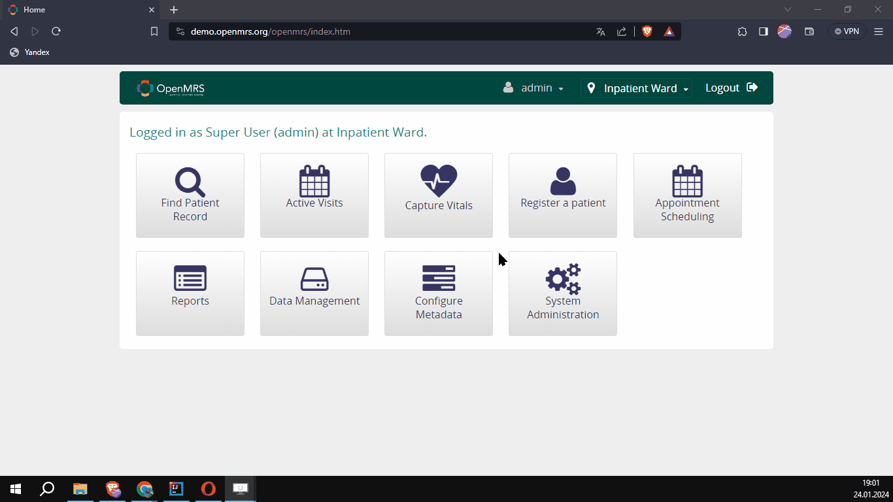

# OPEN MRS INFO:

---

# US_401: Checking Login Errors in the System
## As a user, I want to see a warning message for incorrect login attempts in the system. This enhances the security of the application.

## Acceptance Criteria (AC_01)
1. The user navigates to the home page.
2. Clicks on the [*DEMO*] button.
3. Selects [*Explore OpenMRS 2*].
4. Clicks on [*Enter the OpenMRS 2 Demo*].
5. Redirected to the login page.
6. Enters an invalid username and password from Customer Data.
7. Clicks the "**Login**" button.
8. Receives [*You must choose a location!*] warning.
9. Can view and click on location sections in Customer Data.
10. Clicks on [*Inpatient Ward*].
11. Enters invalid credentials again from Customer Data.
12. Clicks the "**Login**" button.
13. Receives [*Invalid username/password. Please try again.*] warning.
14. Optionally, the user successfully logs in with valid data.

## PreConditions
- Chrome, Safari, or Firefox browsers must be installed and launched for the test environment.
- Internet access is required in the test environment.
- The test environment is [*https://openmrs.org/*](https://openmrs.org/).
- To ensure system stability, the user requests trying six different unsuccessful logins using TestNG @DataProvider
  before a successful login.

## Customer Data
- **Invalid Data:**
    - Username: null or optional
    - Password: null or optional
    - Location: null or [*Inpatient Ward*]
- **Valid Data:**
    - Username: *admin*
    - Password: *Admin123*
    - Location: [*Inpatient Ward*, *Isolation Ward*, *Laboratory*, *Outpatient Clinic*, *Pharmacy*, *Registration Desk*]

## Priority and Tags
**Priority:** M (Smoke, Login)

---

# US_402: Perform Login in the System
## As a user, I want to be able to log into the system so that I can benefit from the application's features.

## Acceptance Criteria (AC_02)
1. The user navigates to the home page.
2. Clicks on the [*DEMO*] button.
3. Selects [*Explore OpenMRS 2*].
4. Clicks on [*Enter the OpenMRS 2 Demo*].
5. Navigates to the login page.
6. Enters the valid username and password from Customer Data.
7. Clicks on the desired [Location] button for login.
8. After entering the valid username and password, the user can log in to their registered user account by clicking the "**Login**" button.

## PreConditions
- Chrome, Safari, or Firefox browsers must be installed and launched for the test environment.
- Internet access is required in the test environment.
- The test environment is [*https://openmrs.org/*](https://openmrs.org/).
- To ensure system stability, the user requests trying six different unsuccessful logins using TestNG @DataProvider before a successful login.

## Customer Data
- **Invalid Data:**
  - Username: null or optional
  - Password: null or optional
  - Location: null or [*Inpatient Ward*]
- **Valid Data:**
  - Username: *Admin*
  - Password: *Admin123*
  - Location:  [*Inpatient Ward*]

## Priority and Tags
**Priority:** H (Smoke, Login)

---

# US_403: Perform Logout from the System
## As a user, I want to securely log out of the system so that I can ensure the application is not left open.

## Acceptance Criteria (AC_03)
1. The user must be successfully logged in.
2. The user should be able to see the selected location during login on the logged-in page.
3. The user must see and be able to click on the [Logout] button.
4. Upon clicking the [Logout] button, the user should be able to securely end the session.
5. The user is redirected to the login page after logging out.

## PreConditions
- Chrome, Safari, or Firefox browsers must be installed and launched for the test environment.
- Internet access is required in the test environment.
- The test environment is [*https://openmrs.org/*](https://openmrs.org/).
- The user must be logged into the system.

## Customer Data
- **Valid Data:**
  - Username: *admin*
  - Password: *Admin123*
  - Location:  [*Inpatient Ward, Isolation Ward, Laboratory, Outpatient Clinic, Pharmacy, Registration Desk*]

## Priority and Tags
**Priority:** H (Smoke, Logout)

---

# US_404: Patient Registration
## As a user, I want to be able to register a patient by entering their information into the system. This way, I won't need another application when I require patient information.

## Acceptance Criteria (AC_04)
1. The user is on the Login page.
2. The user randomly clicks on the Location button.
3. The user successfully logs in (Depends on [US_402](#us_402)).
4. The user clicks on the [Register a patient] button.
5. The user enters the data provided by Customer Data (Demographics / Contact Info / Relationships).
6. The user clicks the Confirm button and is redirected to the patient page.
7. The user should be able to view and verify the name and ID of the registered patient on the patient's page.

## PreConditions
- Same conditions as in [US_403].
- This Story Depends on [US_402].

## Customer Data
- **Valid Data:**
  - Username: *admin*
  - Password: *Admin123*
  - Location:  [*RANDOM*]
- **Form Data:**
  - Demographics: Name, Gender, Birthdate
  - Contact Info: Address, Phone
  - Relationship: Relatives (Family / Close / Attendant Information) [Random or desired values can be entered.]

## Priority and Tags
**Priority:** H (Regression)

---

# US_405: My Account
## As a user, I want to have an icon or link on the homepage that leads to my account settings. This way, I can quickly access settings related to my account.

## Acceptance Criteria (AC_05)
1. The user is on the Login page.
2. The user randomly clicks on the Location button.
3. The user successfully logs in (Depends on [US_402](#us_402)).
4. When hovering over the profile icon, the user should see the [My Account] link, and it should be clickable.
5. Upon clicking the [My Account] link, the user should be able to see and click on the "Change Password" and "My Languages" buttons.

## PreConditions
- Same conditions as in [US_403].
- This user story depends on [US_402]

## Customer Data
- **Valid Data:**
  - Username: *admin*
  - Password: *Admin123*
  - Location:  [*RANDOM*]

## Priority and Tags
**Priority:** H (Smoke)

---

# US_406: Patient Search in Patient List
## As a doctor, I want to list patients, search for a specific patient within this list (by name or ID), and access their information. This way, I can effectively treat the patient.

## Acceptance Criteria (AC_06)
1. The doctor, logged in as [admin] on the application homepage.
2. The doctor clicks on the [Find Patient Record] button.
3. The doctor successfully searches for a patient using information such as name, surname, or ID.
4. The doctor should be able to view and click on the search result.
5. When clicking on the search result, the doctor should be able to access the patient's medical history, appointments, and other information.
6. If the doctor attempts to search for a non-existent patient, they receive a warning message: "No matching records found" -NEGATIVE-.

## PreConditions
- Same conditions as in [US_403].
- The doctor must have admin privileges.
- The patient to be found must be registered.

## Sample Data
- **Sample Patient:**
  - Name: Emma Hostert
  - Patient ID: 100 HTR

## Priority and Tags
**Priority:** H (PatientManagement)

---

# US_407: Patient Deletion
## As a doctor, I want to be able to delete a patient from the system to ensure the confidentiality of their information.

## Acceptance Criteria (AC_07)
1. The doctor, logged in as [admin] on the application homepage.
2. The doctor clicks on the [Find Patient Record] button.
3. The doctor enters the name or ID of the patient they want to find in the search box.
4. The doctor should be able to click on the found patient in the search result.
5. Clicking on the patient, the doctor should access a page where they can perform actions related to the patient.
6. On this page, the doctor finds and clicks the [Delete Patient] link under the "General Actions" tab.
7. The doctor confirms the deletion by entering a reason in the confirmation box.
8. The doctor successfully deletes the patient.
9. The patient's records are removed from the system.

## PreConditions
- Same conditions as in [*US_403*] and [*US_406*].
- The doctor must have admin privileges.
- The patient to be deleted must be registered.
- The doctor must have the necessary authorization to delete the patient.
- An admin-authorized user can perform the functions of a doctor.

## Sample Deletion Reasons
- **[
  _Privacy,
  Incorrect Information,
  Relationship Error,
  Decease,
  Patient Request,
  Legal Reason,
  Security Breach,
  Database Issue_
  ]**

## Priority and Tags
**Priority:** M (Smoke, PatientManagement)

---

# US_408: Patient Listing
## As a doctor, I want to list all patients so that I can plan more effectively.

## Acceptance Criteria (AC_08)
1. The user is logged in on the application homepage.
2. The user clicks on the [*Find Patient Record*] button.
3. The user should see and verify that the total number (Z) displayed in the format [*Showing X to Y of Z entries*] at the bottom of the patient table is the same as the number of rows in the patient table.

## PreConditions
- Same conditions as in [*US_406*].

## Priority and Tags
**Priority:** M (Regression, PatientManagement)

---

# US_409: Patient Record Merge
## As a doctor, I want to merge two patient records that I previously entered so that I can manage prescriptions more efficiently.

## Acceptance Criteria (AC_09)
1. The doctor, logged in as [*admin*] on the application homepage.
2. The doctor performs the patient registration process described in [*US_404*] twice and saves the obtained IDs (ID1 and ID2).
3. The doctor is on the application homepage.
4. The doctor clicks on the [*Data Management*] link.
5. The doctor clicks on the [*Merge Patient Electronic Records*] button.
6. The doctor enters the values ID1 and ID2 into the two consecutive Patient ID fields.
7. The doctor clicks the [*Continue*] button.
8. The doctor sees a warning: "Merging cannot be undone! Please check records before continuing."
9. The doctor selects which patient record to merge (clicks).
10. The doctor clicks the [*Yes, Continue*] button.
11. The doctor sees the IDs **_ID1_** and **_ID2_** in the top right corner under the Patient ID.

## PreConditions
- Same conditions as in [*US_406*].

## Priority and Tags
**Priority:** M (Regression, PatientManagement)

---

# US_410: Incorrect System Timezone during Appointment Booking
## As a user, I want to see an error message when trying to schedule a patient appointment if the system clock is set to a timezone other than GMT+0.

## Acceptance Criteria (AC_10)
1. The user's system timezone is set to a timezone other than UTC+0 (GMT+0).
2. The user is logged in on the application homepage.
3. The user attempts to schedule a patient appointment:
4. Clicks on the [Appointment Scheduling] button.
5. Clicks on [Manage Appointments].
6. Enters the ID or name created during patient registration in the search input.
7. Selects the patient from the displayed list by clicking on them.
8. The user should see and verify the error message:
  - _"Your computer is not set to the right time zone. Please change to Coordinated Universal Time and then close and restart your browser to assure proper scheduling functionality."_

**Optional Criterion (User Assertion)**:
- When the user sets their computer system time to GMT+0, they follow the same steps and assert that the error message doesn't appear. ( _Can be considered similar to [US_411]_ ).

## PreConditions
- Same conditions as in [*US_403*].
- There must be a registered patient in the system.
- [*US_410*] is dependent on [*US_402*].
- The user's computer system timezone is set to a timezone other than **UTC+0 (GMT+0)**.

## Priority and Tags
**Priority:** H (Regression, Appointment)

---

# Notes

## Note 1:
- **Test Environment to be used:**
  - [https://openmrs.org/](https://openmrs.org/) is the address.
  - Username: `admin`     Password: `Admin123`

## Note 2:
- **The group naming in the last column (naming of groups for user stories) is provided as an example.**
  - You can name your Test Groups as you wish when running tests from the TestNG xml file.

## Note 3:
- **Every week we have a theme for using the topics we've learned.**
  - This week, let's use **`Page Object Model`** in our project; try to utilize the powerful features of **`TestNG`**:
    - Run tests from the `xml` file by grouping them,
    - Use `@DataProvider` during our data inputs,
    - Give priority to some of our test methods,
    - Generate an `HTML report` at the end of the test.

## Note 4:
- **PreConditions:**
  - Usually, the Product Owner (PO) defines preconditions for user stories and adds these preconditions to the user stories.
  - However, in some cases, the responsibility for determining these preconditions may also be with the team.
